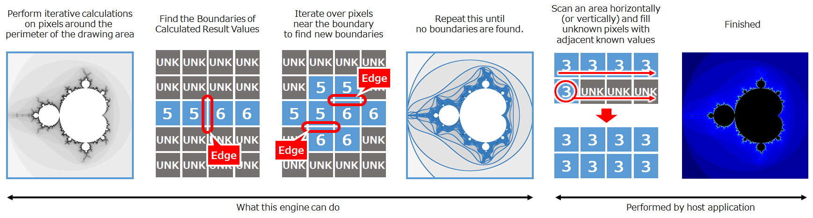
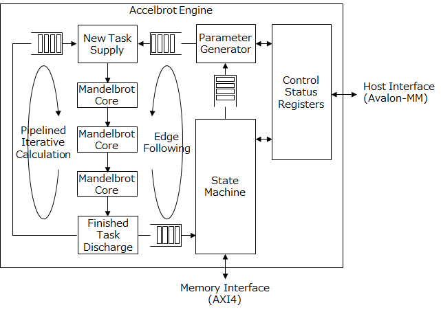
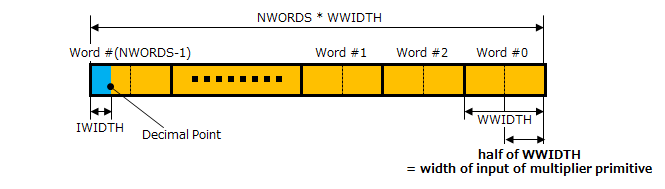

# Accelbrot

A high-speed, high-precision Mandelbrot set accelerator

## Video

This 4:40 video was created by generating 230 Full-HD images using FPGA and interpolating them using OpenCV.

- YouTube : [Mandelbrot Zoom (FPGA Accelerated)](https://youtu.be/rN9VtHJ6S8I)
- ニコニコ動画 : [FPGAでマンデルブロ集合ズーム動画を作ってみた](https://www.nicovideo.jp/watch/sm42516023)

## Algorithm

## Block Diagram

## Interface

|Port|Description|
|:--|:--|
|`clk`|Clock Input|
|`rstn`|Synchronous Negative Reset|
|`reg_xxxx`|Register Interface (Avalon-MM Slave)|
|`wram_xxxx`|Working-Memory Interface (AXI4 Master)|

## Parameters

|Parameter|Default Value|Description|
|:--|:--:|:--|
|`NCORES`|`3`|Number of Mandelbrot Cores|
|`NWORDS`|`8`|Number of words of parameter A/B||
|`WWIDTH`|`34`|Width of each word of parameter A/B|
|`IWIDTH`|`6`|Width of integer part of parameter A/B|
|`CWIDTH`|`20`|Width of iterator counter|
|`PWIDTH`|`12`|Width of pixel counter|
|`QDEPTH`|`16384`|Depth of task queue|
|`AXI_ADDR_WIDTH`|`32`|Width of AXI4 address|
|`AXI_DATA_WIDTH`|`128`|Width of AXI4 data|

- `WWIDTH` should be set to twice the width of the input of the unsigned multiplier primitive.
- `NWORDS` \* `WWIDTH` is the width of the fixed-point number.
- `NCORES` \* `NWORDS` \* 12 + 6 multipliers are consumed, so maximize `NCORES` within FPGA resources.
- `AXI_ADDR_WIDTH` and `AXI_DATA_WIDTH` should be specified according to the bit width of the DDR controller.
- Default values are recommended for all other parameters except above.

## Fixed-Point Format

## Register Map

|Offset|Type|Name|Description|
|:--:|:--:|:--|:--|
|`0x0000`|`RO`|`PRM_VERSION`|RTL Version|
|`0x000C`|`RO`|`PRM_PRSEED`|Seed for P&R|
|`0x0010`|`RO`|`PRM_NCORES`|Value of `NCORES`|
|`0x0014`|`RO`|`PRM_NWORDS`|Value of `NWORDS`|
|`0x0018`|`RO`|`PRM_WWIDTH`|Value of `WWIDTH`|
|`0x001C`|`RO`|`PRM_IWIDTH`|Value of `IWIDTH`|
|`0x0020`|`RO`|`PRM_CWIDTH`|Value of `CWIDTH`|
|`0x0100`|`RO`|`STS_BUSY`|Busy state of FSM|
|`0x0110`|`W`|`STS_LATCH`|One-write to latch status values|
|`0x0120`|`RO`|`STS_FSM_STATE`|FSM state number|
|`0x0128`|`RO`|`STS_AXI_STATE`|AXI bus state|
|`0x0130`|`RO`|`STS_NUM_ACTIVE`|Number of active pixels|
|`0x0134`|`RO`|`STS_NUM_QUEUED`|Number of queued pixels|
|`0x0138`|`RO`|`STS_NUM_ENTERED`|Number of pixels waiting at the entrance of the loop|
|`0x0140`|`RO`|`STS_NUM_RUNNING`|Number of running pixels|
|`0x0144`|`RO`|`STS_NUM_EXITED`|Number of pixels waiting at the exit of the loop|
|`0x0160`|`RO`|`STS_MAX_ITER`|Maximum number of iterations|
|`0x0168`|`RO`|`STS_TOTAL_ITER_L`|Lower 32 bits of total iterations|
|`0x016C`|`RO`|`STS_TOTAL_ITER_H`|Higher 32 bits of total iterations|
|`0x0400`|`W`|`CTL_SOFT_RESET`|Soft Reset|
|`0x0410`|`W`|`CTL_COMMAND`|Control Command|
|`0x0420`|`R/W`|`CTL_IMG_ADDR_L`|Lower 32 bits of base address of image|
|`0x0424`|`R/W`|`CTL_IMG_ADDR_H`|Higher 32 bits of base address of image|
|`0x0430`|`R/W`|`CTL_IMG_WIDTH`|Width of image|
|`0x0434`|`R/W`|`CTL_IMG_HEIGHT`|Height of image|
|`0x0438`|`R/W`|`CTL_IMG_STRIDE`|Line stride of image in bytes|
|`0x0500`|`R/W`|`CTL_A_OFFSET`|Offset of parameter A|
|`0x0504`|`R/W`|`CTL_B_OFFSET`|Offset of parameter B|
|`0x0510`|`R/W`|`CTL_A_STEP_X`|Horizontal step of parameter A|
|`0x0514`|`R/W`|`CTL_A_STEP_Y`|(reserved)|
|`0x0518`|`R/W`|`CTL_B_STEP_X`|(reserved)|
|`0x051C`|`R/W`|`CTL_B_STEP_Y`|Vertical step of parameter B|
|`0x0540`|`R/W`|`CTL_MAX_ITER`|Maximum number of iterations|
|`0x0600`|`R/W`|`CTL_RECT_X`|X coordinate of left edge of rect|
|`0x0604`|`R/W`|`CTL_RECT_Y`|Y coordinate of top edge of rect|
|`0x0608`|`R/W`|`CTL_RECT_WIDTH`|Width of rect|
|`0x060c`|`R/W`|`CTL_RECT_HEIGHT`|Height of rect|
|`0x0610`|`R/W`|`CTL_RECT_VALUE`|Value userd for fill|
|`0x0614`|`R/W`|`CTL_CMD_FLAGS`|Command options|
|`0x4000-0x7FFF`|`RO`|`BUFF_RAM`|Read buffer|

## How to Control

See `tb_top.sv`. Details will be provided in the future.

----
