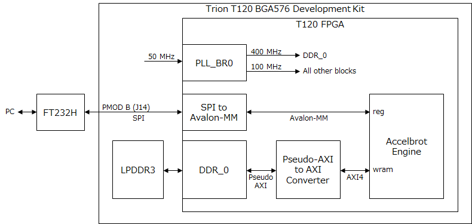

# Accelbrot for Efinix T120

## Block Diagram

## FT232H Pin Assign

|J14 Pin Number|HDL Port Name|FPGA Pin Name|
|:--:|:--:|:--:|
|1|spi_cs_n|GPIOB_RXN26|
|2|spi_sck|GPIOB_RXP27|
|3|spi_mosi|GPIOB_RXN27|
|4|spi_miso|GPIOB_RXP28|

----